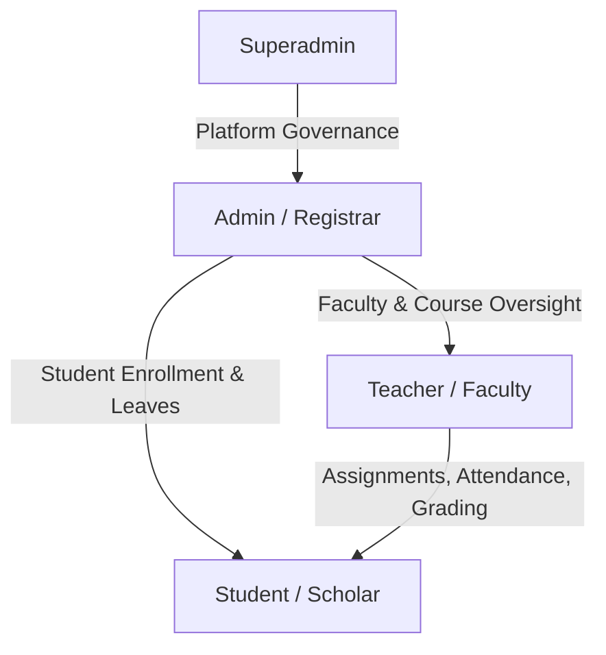

# 📚 E-Study Corner

> A production-grade, full-stack Academic Governance and E-Learning Platform engineered by **Abhay Patel** — built with React 19, Tailwind CSS v4, Express 5, Mongoose 9, role-based access control, automated attendance governance, coursework file streaming, Nodemailer email broadcasting, resilient dual-database persistence, and an automated integration test suite.

---

[](docs/testing.md)
[](Frontend/README.md)
[](https://nodejs.org)
[](https://react.dev)
[](https://tailwindcss.com)
[](https://expressjs.com)
[](LICENSE)

---

## 🌟 What's in E-Study Corner V2.1

The **V2.1 Stability & Quality Release** prioritizes system hardening, test verification, architectural hygiene, security compliance, and developer ergonomics:

1. **Automated Integration Test Suite**:
   - 53 automated backend tests covering authentication, student, teacher, and admin workflows, executing directly on Node's native test runner (`node:test`) with 0 external mock dependencies.
2. **Hardened HTTP Security**:
   - Comprehensive OWASP-compliant security headers: Content-Security-Policy (CSP), Permissions-Policy, Cross-Origin-Opener-Policy (`COOP`), Cross-Origin-Resource-Policy (`CORP`), and anti-sniffing/anti-clickjacking headers.
   - Sliding-window rate limiters on sensitive authentication endpoints.
3. **Frontend Quality & React 19 Standards**:
   - Clean ESLint pass with **0 errors and 0 warnings**.
   - Centralized Axios client (`Frontend/src/services/api.js`) with automatic Bearer token injection, standard error extraction, and 401 session recovery.
   - Fixed responsive sidebar with dark/light themes, ambient gradients, and glassmorphic UI.
4. **Data Resilience & Sanitized Seeding**:
   - Strict database failure handling (`503 DATABASE_UNAVAILABLE`) in production.
   - Automated seeding script (`Backend/seed.js`) driven by environment variables (`SEED_DEFAULT_PASSWORD`).
5. **Complete Documentation Suite**:
   - 10 canonical architectural and operational guides in [`docs/`](docs/README.md).

---

## 📑 Architecture & Technical Guides

Comprehensive technical documentation is located in the [`docs/`](docs/README.md) directory:

| Guide | Link | Focus Area |
|---|---|---|
| 🏗️ **System Architecture** | [`docs/architecture.md`](docs/architecture.md) | Multi-tier MERN stack, data flow, micro-layering |
| 🔌 **API Catalog** | [`docs/api.md`](docs/api.md) | Route reference, request/response schemas, error status codes |
| 🔐 **Authentication** | [`docs/authentication.md`](docs/authentication.md) | JWT token lifecycle, bcrypt hashing, rate limiting, OTP reset |
| 🛡️ **Authorization & RBAC** | [`docs/authorization.md`](docs/authorization.md) | Role permission matrix, middleware guards, IDOR prevention |
| 🗄️ **Database & Models** | [`docs/database.md`](docs/database.md) | 20 Mongoose 9 models, compound indexes, seeding workflows |
| 🎨 **Frontend Architecture** | [`docs/frontend.md`](docs/frontend.md) | React 19, Tailwind v4 design tokens, layout hierarchy, context |
| 🔒 **Security Hardening** | [`docs/security.md`](docs/security.md) | CSP, OWASP headers, input sanitization, DoS defense |
| 🧪 **Testing & QA** | [`docs/testing.md`](docs/testing.md) | Native Node.js test suite (53 tests), ESLint, build verification |
| 🚀 **Deployment** | [`docs/deployment.md`](docs/deployment.md) | Environment configuration, Docker, Vercel/Render, health check |
| 🗺️ **Roadmap & Milestones** | [`docs/roadmap.md`](docs/roadmap.md) | Release milestones, current status, and future iterations |

---

## 👥 Multi-Role Ecosystem & Core Features



### 🎓 Student Features
- **Dashboard**: Enrolled course progress, assignment deadlines, attendance percentage with streak counter (`🔥 Xd`).
- **Learning Hub**: Video lectures, downloadable notes, course modules, and bookmarking.
- **Coursework**: File uploads with live progress bars, submission history, and instructor feedback/scores.
- **Attendance & Leave**: View monthly attendance sheets, check in daily, and apply for student leave.
- **AI Study Coach & Quizzes**: Diagnostic quizzes, score summaries, and weak-topic detection.

### 👨‍🏫 Teacher Features
- **Course Authoring**: Create and manage course modules, attach syllabus, upload downloadable notes.
- **Class Attendance**: Daily attendance marking tool with Present, Absent, Late, and Excused status.
- **Coursework Management**: Publish assignments with deadline constraints, grade submissions with numeric scores and remarks.
- **Student Action Hub**: Unified console to review leaves, grade coursework, and answer academic student doubts.

### 🏛️ Administrator & Superadmin Features
- **User Directory**: Centralized management of Students, Teachers, and Admins (activate, suspend, role assignment).
- **Institution Analytics**: System-wide enrollment metrics, attendance aggregates, and feedback logs.
- **Governance**: Audit and approve campus leave requests, manage platform announcements.
- **Security & System Health**: Live system diagnostics (`/api/health`), database connection monitoring, and audit trails.

---

## 🚀 Quick Start Guide

### Prerequisites
- **Node.js**: `>= 20.x`
- **npm**: `>= 10.x`
- **MongoDB**: `>= 6.x` (or built-in hybrid data store for zero-setup local dev/test)

### 1. Installation
Install dependencies for both projects:
```bash
# Clone the repository
git clone https://github.com/Kaaldut12/E-Study_corder.git
cd E-Study_corder

# Install backend and frontend dependencies
npm --prefix Backend install
npm --prefix Frontend install
```

### 2. Configure Environment Variables

**Backend (`Backend/.env`)**:
```env
PORT=3001
NODE_ENV=development
MONGO_URI=mongodb://127.0.0.1:27017/estudy
JWT_SECRET=supersecretlongkeymin32charactersrequired
JWT_EXPIRES_IN=7d
CORS_ORIGIN=http://localhost:5173
SEED_DEFAULT_PASSWORD=Admin@123
```

**Frontend (`Frontend/.env`)**:
```env
VITE_API_URL=http://localhost:3001
```

### 3. Seed Database
Populate canonical seed accounts and courses:
```bash
npm run seed
```

### 4. Run Development Servers
```bash
# Start Backend API (http://localhost:3001)
npm run dev:backend

# Start Frontend Client (http://localhost:5173)
npm run dev:frontend
```

---

## 🧪 Verification & Testing

Execute the automated test and code quality suites:

```bash
# Run 53 automated backend integration tests (node:test)
npm test

# Run strict frontend ESLint verification (0 errors, 0 warnings)
npm run lint

# Verify frontend production build bundle
npm run build
```

---

## 🔑 Canonical Test Accounts

| Role | Name | Email | Default Password |
|---|---|---|---|
| **Superadmin** | Abhay Patel | `abhaypatel2556444@gmail.com` | `SuperAdmin@123` |
| **Admin** | Admin Officer | `admin@estudy.com` | `Admin@123` |
| **Teacher** | Faculty Lecturer | `teacher@estudy.com` | `Admin@123` |
| **Student** | Student Scholar | `student@estudy.com` | `Admin@123` |
| **Student** | Priya Sharma | `priya@estudy.com` | `Admin@123` |
| **Student** | Rahul Verma | `rahul@estudy.com` | `Admin@123` |

*(Note: In production environments, set `SEED_DEFAULT_PASSWORD` to a secure custom passphrase).*

---

## 👨‍💻 Developer & Portfolio

- **Author**: **Abhay Patel**
- **GitHub Profile**: [@Kaaldut12](https://github.com/Kaaldut12)
- **Project Repository**: [Kaaldut12/E-Study_corner](https://github.com/Kaaldut12/E-Study_corner)
- **Contact**: `abhaypatel2556444@gmail.com`

---

## 📄 License
ISC License — © 2026 Abhay Patel / E-Study Corner. All Rights Reserved.
