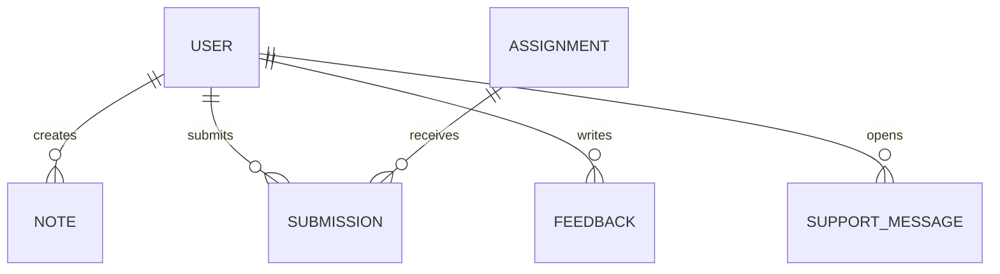

# Entity-Relationship (ER) Diagram

```mermaid
erDiagram
    USER ||--o{ NOTE : creates
    USER ||--o{ SUBMISSION : submits
    ASSIGNMENT ||--o{ SUBMISSION : receives
    USER ||--o{ FEEDBACK : writes
    USER ||--o{ SUPPORT_MESSAGE : opens
```
