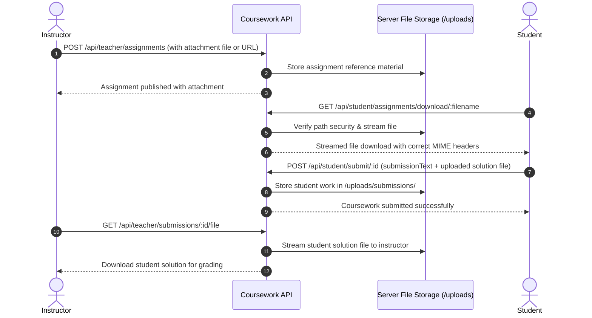

# Coursework File Upload & Download System

The **Coursework File Upload & Download System** powers file attachments for assignments, homework, and student project solutions across E-Study Corner.

---

## 1. File Lifecycle & Pipeline

---

## 2. Supported File Formats & Security

### Supported Formats:
- **Documents**: `.pdf`, `.docx`, `.doc`, `.txt`, `.rtf`
- **Code & Archives**: `.zip`, `.tar.gz`, `.js`, `.py`, `.java`, `.cpp`
- **Media**: `.png`, `.jpg`, `.jpeg`

### Security Measures:
- **Path Traversal Protection**: File paths are validated against allowed root directories (`Backend/uploads`) to prevent `../` directory traversal attacks.
- **MIME Type Validation**: Headers are dynamically resolved using file extension mapping.
- **Client-Side Progress**: Uploads display real-time percentage indicators.
- **Safe Browser Downloads**: The client utility `downloadFile(fileUrl, preferredName)` initiates streaming downloads via native blob objects, preventing browser redirection or blank tabs.

---

## 3. Endpoints

| Endpoint | Method | Roles | Description |
| :--- | :--- | :--- | :--- |
| `/api/teacher/assignments` | `POST` | `teacher`, `admin` | Create assignment with optional attached file |
| `/api/student/assignments/download/:filename` | `GET` | `student`, `teacher`, `admin` | Stream assignment reference file to client |
| `/api/student/submit/:assignmentId` | `POST` | `student` | Submit coursework with uploaded solution file |
| `/api/teacher/submissions/:id/file` | `GET` | `teacher`, `admin` | Stream student submission solution file |
