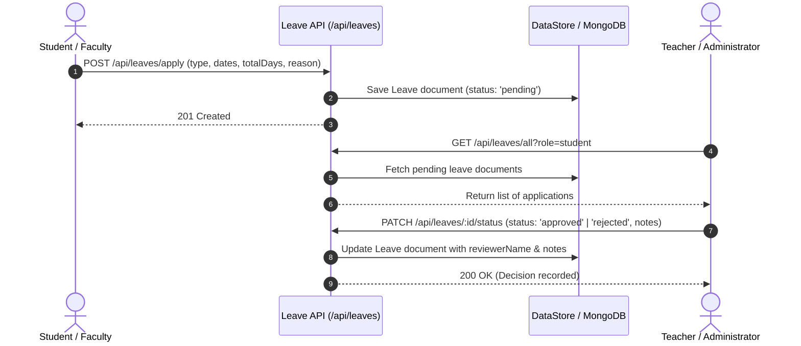

# Leave Management System

The **Leave Management System** provides an end-to-end workflow for student attendance exemptions and faculty leave applications across E-Study Corner.

---

## 1. System Overview & Workflow



---

## 2. Leave Categories

| Category ID | Display Label | Applicable Roles | Typical Use Case |
| :--- | :--- | :--- | :--- |
| `casual` | Casual / Personal Leave | Student, Teacher | Family events, urgent personal matters |
| `sick` | Medical / Sick Leave | Student, Teacher | Illness, medical treatment, hospitalization |
| `academic` | Academic / Training Leave | Student, Teacher | Conferences, competitions, training seminars |
| `vacation` | Official Vacation / Break | Teacher | Official term breaks or faculty leave periods |

---

## 3. Interfaces & Role Capabilities

### A. Student Portal (`/student/leave`)
- **Application Form**: Interactive start date and end date selectors with automatic day calculation, category dropdown, and detailed reason textarea.
- **Application History**: List of past and active leave applications displaying status badges (`⏳ Pending Review`, `✓ Approved`, `✕ Rejected`), total days, date intervals, and official reviewer remarks.

### B. Teacher Portal (`/teacher/leave`)
- **Faculty Application Tab**: Teachers apply for personal faculty leaves.
- **Student Requests Tab**:
  - Live metric summary: Total Inquiries, Awaiting Review, Approved Grants, Declined applications.
  - Search box: Filters by student name, email, or reason.
  - Filter pills: `All`, `Pending`, `Approved`, `Rejected`.
  - Quick Actions: One-click "Quick Approve" (`✓`) or "Quick Reject" (`✕`).
  - Evaluation Modal: Form to input custom feedback notes before confirming decision.

### C. Administrator Portal (`/admin/leaves`)
- Centralized institutional console auditing all leaves across both faculty and student body.
- Multi-dimensional filtering by user role (`student`, `teacher`), status, and keywords.

---

## 4. REST API Reference

### 1. Apply for Leave
- **Endpoint**: `POST /api/leaves/apply`
- **Auth**: Required (`verifyToken`)
- **Payload**:
  ```json
  {
    "leaveType": "sick",
    "startDate": "2026-09-12",
    "endDate": "2026-09-14",
    "totalDays": 3,
    "reason": "Medical rest advised by physician."
  }
  ```
- **Response**: `201 Created` with leave record.

### 2. Get User's Own Leaves
- **Endpoint**: `GET /api/leaves/my-leaves`
- **Auth**: Required (`verifyToken`)
- **Response**: List of user's personal leave requests.

### 3. Get All Leaves (Reviewers)
- **Endpoint**: `GET /api/leaves/all?role=student`
- **Auth**: Required (`requireRole(['admin', 'teacher', 'superadmin'])`)
- **Response**: List of leave applications matching query filters.

### 4. Update Leave Status (Evaluate)
- **Endpoint**: `PATCH /api/leaves/:id/status`
- **Auth**: Required (`requireRole(['admin', 'teacher', 'superadmin'])`)
- **Payload**:
  ```json
  {
    "status": "approved",
    "reviewerNotes": "Approved. Please submit doctor's certificate upon return."
  }
  ```
- **Response**: `200 OK` with updated leave object.
