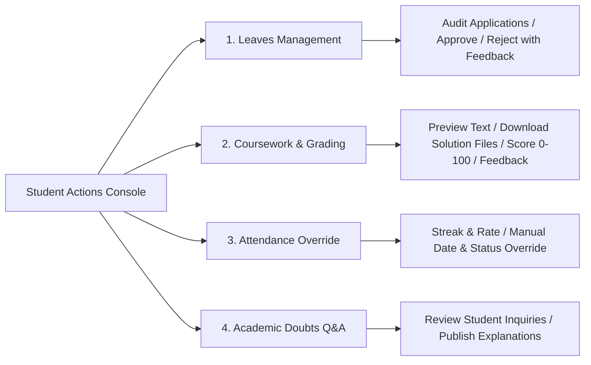

# Universal Student Action Governance Hub

The **Universal Student Action Governance Hub** provides a centralized, cross-role interface for Teachers and Institutional Administrators to inspect, evaluate, grade, and manage every action taken by enrolled students.

---

## 1. Governance Console Architecture (`ManageStudents.jsx`)

The governance console is accessible to:
- **Teachers** via `/teacher/students`
- **Administrators** via `/admin/students`
- **Deep-linking** from the Admin User Directory (`/admin/users`) via the **`⚡ Manage Actions`** button (`/admin/students?studentId=${id}`)

### The 4 Governance Pillars:

---

## 2. Console Tabs & Features

### 1. 🏖️ Leaves Governance
- **Profile Summary**: Displays the student's leave statistics (Total Applied, Approved, Rejected).
- **Application History**: List of all leave requests submitted by the student with start date, end date, total days, and purpose.
- **Evaluation Action**:
  - Approve or Reject button.
  - Remarks textarea to communicate official reasoning to the student.
  - Changes reflect immediately in the student's portal.

### 2. 📝 Coursework & Grading
- **Submissions List**: All assignments submitted by the student across their enrolled subjects.
- **Submission Details**:
  - Submission timestamp and deadline compliance status.
  - Text preview / code snippet preview.
  - **File Attachment**: Direct download link for student-uploaded files (`downloadFile(url, filename)`).
- **Grading Form**:
  - Numeric score input (validated $0 \le \text{score} \le \text{maxPoints}$).
  - Qualitative feedback textarea.
  - Re-grading capability: Instructors and admins can update scores and feedback at any time.

### 3. 📅 Attendance Governance
- **Attendance Summary**: Active streak count, present days, absent days, and monthly participation percentage.
- **Attendance History Log**: Chronological audit of daily records.
- **Manual Override Controls**:
  - Pick any calendar date.
  - Select status: `Present`, `Absent`, or `Excused`.
  - Provide administrative justification (e.g. "Excused due to approved leave").

### 4. 💬 Academic Doubts & Q&A
- **Student Questions**: All academic queries submitted by the student to instructors.
- **Status Pills**: `Pending Reply` vs. `Answered`.
- **Inline Reply Form**: Textarea to author clear explanations and solutions.

---

## 3. Associated Endpoints & Backend Security

All governance endpoints are guarded by `requireRole(['teacher', 'admin', 'superadmin'])`:

- `GET /api/teacher/students/:studentId/details` (or `/api/admin/students/:studentId/details`): Aggregates profile, submissions, leaves, attendance stats, and questions in a single $O(1)$ query.
- `PATCH /api/leaves/:id/status`: Updates leave approval status with reviewer notes.
- `POST /api/teacher/submissions/:id/grade`: Records numeric points and feedback.
- `POST /api/attendance/mark-student`: Creates or updates attendance logs for any student/date.
- `POST /api/teacher/questions/:id/reply`: Dispatches instructor responses.
