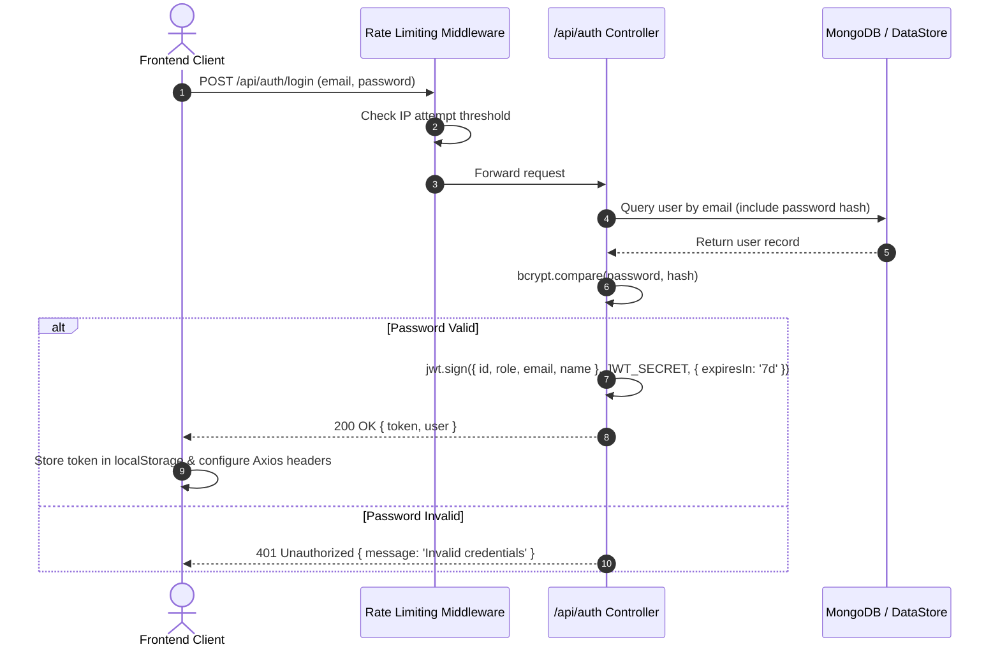

# Authentication Guide

This document details the authentication architecture, token lifecycle, password security, rate limiting, and recovery mechanisms in the **E-Study Corner** platform.

---

## 1. Overview

E-Study Corner utilizes a stateless, token-based authentication mechanism powered by **JSON Web Tokens (JWT)** and **bcryptjs** password hashing. User authentication is secured against brute-force attacks via sliding-window rate limiters and strict validation middleware.



---

## 2. Password Security & Hashing

- **Hashing Algorithm**: `bcryptjs` with salt round factor **10**.
- **Model Hooks**: The `User` Mongoose schema employs a `pre('save')` middleware hook:
  ```javascript
  userSchema.pre('save', async function(next) {
    if (!this.isModified('password')) return next();
    const salt = await bcrypt.genSalt(10);
    this.password = await bcrypt.hash(this.password, salt);
    next();
  });
  ```
- **Validation**: Passwords must contain a minimum of 6 characters (recommended 8+ with mixed case and numeric characters).
- **Password Masking**: The password field is explicitly marked `select: false` or omitted from default serialization to prevent accidental leakage in API responses.

---

## 3. JWT Token Architecture

### Token Specification
| Property | Value |
|---|---|
| **Standard** | RFC 7519 JSON Web Token |
| **Signing Algorithm** | HMAC-SHA256 (`HS256`) |
| **Expiry** | `7d` (7 days) configurable via `JWT_EXPIRES_IN` |
| **Secret Key** | Configured via `JWT_SECRET` environment variable |

### Token Payload
```json
{
  "id": "65f2a1b9c3d4e5f6a7b8c9d0",
  "role": "student",
  "email": "student@estudy.com",
  "name": "Student Scholar",
  "iat": 1726000000,
  "exp": 1726604800
}
```

---

## 4. Authentication Middleware (`authMiddleware`)

All protected endpoints pass through `Backend/src/middleware/auth.js`.

### Flow:
1. Extracts the token from the `Authorization` HTTP header:
   ```http
   Authorization: Bearer <jwt-token-string>
   ```
2. Verifies signature and expiration using `jwt.verify(token, JWT_SECRET)`.
3. Validates that the referenced user exists in the database and is not suspended.
4. Attaches the decoded user profile to the Express request object (`req.user = user`).
5. Returns `401 Unauthorized` if the token is missing, expired, or malformed.

```javascript
// Example Express Protected Route
router.get('/profile', authMiddleware, async (req, res) => {
  res.json({ success: true, user: req.user });
});
```

---

## 5. Brute-Force & Rate Limiting

To protect authentication endpoints against credential stuffing and brute-force attacks, specialized rate limiters are applied in `Backend/src/routes/auth.js`:

| Route | Limit | Window | Error Response |
|---|---|---|---|
| `POST /api/auth/login` | 5 requests | 15 minutes | `429 Too Many Requests` |
| `POST /api/auth/register` | 5 accounts | 60 minutes | `429 Too Many Requests` |
| `POST /api/auth/forgot-password` | 3 requests | 30 minutes | `429 Too Many Requests` |

Limiters track client IP addresses using sliding-window counters.

---

## 6. Password Reset Flow (OTP)

1. **Request Reset (`POST /api/auth/forgot-password`)**:
   - Client sends registered `email`.
   - Backend generates a cryptographically secure 6-digit numeric One-Time Password (OTP).
   - OTP is hashed and saved with a 10-minute expiration time.
   - If an email service is configured (`NODEMAILER_*`), an email is dispatched. In offline/demo mode, a verification code is logged or returned in safe development responses.
2. **Verify & Reset (`POST /api/auth/reset-password`)**:
   - Client provides `{ email, otp, newPassword }`.
   - Backend validates that the OTP has not expired and matches the hash.
   - User password is updated and rehashed via `bcrypt.hash`.
   - All active reset tokens for that user are invalidated.

---

## 7. Client-Side Token Management

The React 19 frontend manages authentication state through `Frontend/src/context/AuthContext.jsx`:

1. **Storage**: On successful authentication, the token and user dictionary are written to `localStorage`:
   ```javascript
   localStorage.setItem('token', data.token);
   localStorage.setItem('user', JSON.stringify(data.user));
   ```
2. **Interception**: The central Axios client (`Frontend/src/services/api.js`) automatically reads the token and injects it into every outgoing request:
   ```javascript
   api.interceptors.request.use((config) => {
     const token = localStorage.getItem('token');
     if (token) {
       config.headers.Authorization = `Bearer ${token}`;
     }
     return config;
   });
   ```
3. **Session Invalidation**: If any API call returns `401 Unauthorized`, the response interceptor cleans up `localStorage` and redirects the user to `/login`.
