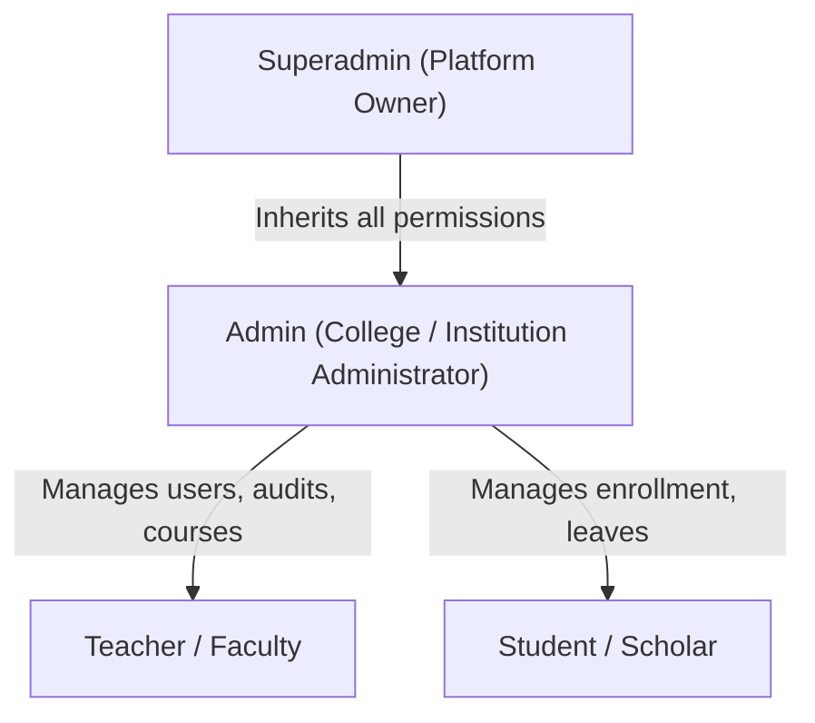

# Authorization & Access Control Guide

This document defines the Role-Based Access Control (RBAC) model, route permission matrix, resource ownership policies, and frontend navigation guards in the **E-Study Corner** platform.

---

## 1. Role Hierarchy

E-Study Corner enforces a 4-tier role hierarchy:



| Role | Target Persona | Scope |
|---|---|---|
| **`superadmin`** | System administrator / Developer | Unrestricted system access, backup control, system audit logs. |
| **`admin`** | Academic administrator / Registrar | User management, college announcements, system settings, approval of teacher roles. |
| **`teacher`** | Faculty / Instructor / Lab Assistant | Course creation, assignment grading, attendance logging, quiz authoring. |
| **`student`** | Enrolled student / Learner | Course consumption, quiz participation, submission uploads, leave applications. |

---

## 2. Role Capability Matrix

| Feature / Action | Student | Teacher | Admin | Superadmin |
|---|:---:|:---:|:---:|:---:|
| Browse Courses & Notes | ✅ | ✅ | ✅ | ✅ |
| Enroll in Courses | ✅ | ❌ | ❌ | ❌ |
| Submit Assignments & Quizzes | ✅ | ❌ | ❌ | ❌ |
| Apply for Student Leave | ✅ | ❌ | ❌ | ❌ |
| Track Personal Attendance & Grades | ✅ | ❌ | ❌ | ❌ |
| Create Courses & Modules | ❌ | ✅ | ✅ | ✅ |
| Upload Notes & Learning Materials | ❌ | ✅ | ✅ | ✅ |
| Grade Student Submissions | ❌ | ✅ | ✅ | ✅ |
| Take Daily Class Attendance | ❌ | ✅ | ✅ | ✅ |
| Approve / Reject Student Leaves | ❌ | ✅ | ✅ | ✅ |
| Manage User Accounts (Create / Ban) | ❌ | ❌ | ✅ | ✅ |
| View System Logs & Analytics | ❌ | ❌ | ✅ | ✅ |
| Broadcast System Announcements | ❌ | ❌ | ✅ | ✅ |
| Configure Platform Security & Backups | ❌ | ❌ | ❌ | ✅ |

---

## 3. Backend Authorization Middleware

Permissions are enforced at the router layer using `roleMiddleware` from `Backend/src/middleware/auth.js`.

### Syntax
```javascript
const { authMiddleware, roleMiddleware } = require('../middleware/auth');

// Allow single role
router.post('/courses', authMiddleware, roleMiddleware(['teacher']), courseController.create);

// Allow multiple roles
router.get('/reports', authMiddleware, roleMiddleware(['teacher', 'admin', 'superadmin']), reportController.get);

// Admin-exclusive routes
router.delete('/users/:id', authMiddleware, roleMiddleware(['admin', 'superadmin']), userController.delete);
```

### Authorization Pipeline
1. `authMiddleware` verifies the JWT signature and injects `req.user`.
2. `roleMiddleware(allowedRoles)` evaluates:
   ```javascript
   if (!allowedRoles.includes(req.user.role)) {
     return res.status(403).json({
       success: false,
       message: `Access denied. Requires one of: ${allowedRoles.join(', ')}`
     });
   }
   next();
   ```

---

## 4. Resource Ownership Verification

Beyond static role checks, mutative operations enforce **Resource Ownership Validation** to prevent Insecure Direct Object Reference (IDOR) vulnerabilities:

### Example: Course Modification
When a teacher attempts to update or delete a course:
```javascript
const course = await Course.findById(req.params.id);
if (!course) {
  return res.status(404).json({ success: false, message: 'Course not found' });
}

// Admins and Superadmins bypass ownership checks
const isPrivileged = ['admin', 'superadmin'].includes(req.user.role);
const isOwner = course.instructorId.toString() === req.user.id.toString();

if (!isOwner && !isPrivileged) {
  return res.status(403).json({
    success: false,
    message: 'Access denied: You do not have permission to modify this course.'
  });
}
```

### Example: Student Submissions
A student may only view or modify their own assignment submissions:
```javascript
if (req.user.role === 'student' && submission.studentId.toString() !== req.user.id.toString()) {
  return res.status(403).json({ success: false, message: 'Forbidden access to another student submission.' });
}
```

---

## 5. Frontend Route Guards

The React frontend prevents unauthorized screen access using `ProtectedRoute` and `RoleRoute` components (`Frontend/src/components/common/`):

```jsx
// App.jsx routing excerpt
<Route
  path="/teacher/*"
  element={
    <ProtectedRoute>
      <RoleRoute allowedRoles={['teacher', 'admin', 'superadmin']}>
        <SidebarLayout>
          <TeacherRoutes />
        </SidebarLayout>
      </RoleRoute>
    </ProtectedRoute>
  }
/>
```

### Guard Behavior:
- **Unauthenticated Users**: Redirected to `/login` with the attempted location preserved in navigation state (`from: location`).
- **Role Mismatch**: If a logged-in student attempts to navigate directly to `/teacher/create-course` or `/admin/users`, they are redirected to their authorized dashboard (`/student/dashboard`) or shown an unauthorized notice.
