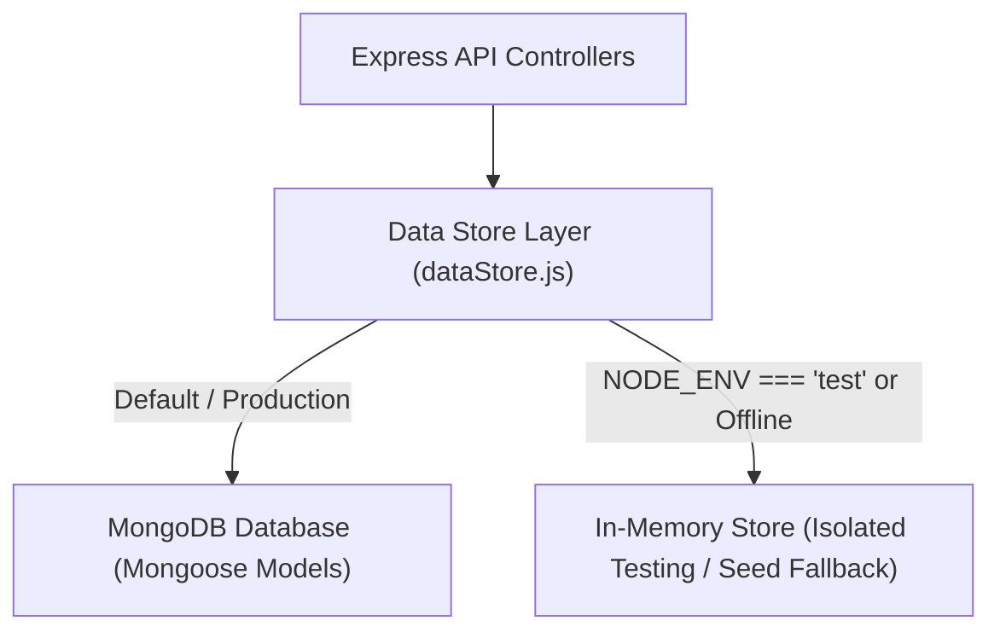

# Database Architecture & Schemas Guide

This document covers the database design, Mongoose models, indexing strategies, seed workflows, and data resilience mechanisms in **E-Study Corner**.

---

## 1. Architecture Overview

E-Study Corner employs **MongoDB** as its primary persistent document store via **Mongoose 9 ODM**, complemented by an internal data service layer (`Backend/src/services/dataStore.js`):



- **Production Mode**: Direct connection to MongoDB instance/cluster defined in `MONGO_URI`. If the database is unreachable, requests fail securely with a `503 DATABASE_UNAVAILABLE` error rather than corrupting ephemeral storage.
- **Test Mode**: Automated tests utilize the isolated in-memory store for instantaneous test execution (~6 seconds for 53 tests) without external database dependencies.

---

## 2. Core Mongoose Models & Schemas

The system defines 20 Mongoose models located in `Backend/models/`:

| Model File | Primary Purpose | Key Indexes |
|---|---|---|
| `User.js` | User accounts, credentials, academic profile, role | `{ email: 1 }` (unique), `{ role: 1, status: 1 }` |
| `Course.js` | Academic courses, syllabus, instructor details | `{ code: 1 }`, `{ teacherId: 1 }`, `{ subject: 1 }` |
| `Lesson.js` | Course units, video URLs, markdown contents | `{ courseId: 1 }` |
| `Assignment.js` | Course tasks, deadlines, max scores, file attachments | `{ courseId: 1 }`, `{ teacherId: 1 }` |
| `Submission.js` | Student assignment uploads, grades, remarks | `{ assignmentId: 1, studentId: 1 }` |
| `Quiz.js` | Objective tests, time limits, question lists | `{ courseId: 1 }` |
| `QuizAttempt.js` | Student quiz submissions, answers, calculated score | `{ quizId: 1, studentId: 1 }` |
| `Attendance.js` | Daily class attendance records, status, timestamp | `{ studentId: 1, date: 1 }`, `{ courseId: 1 }` |
| `Leave.js` | Student leave requests, reasons, approval status | `{ studentId: 1 }`, `{ status: 1 }` |
| `Note.js` | Teacher study material, downloadable documents | `{ courseId: 1 }`, `{ teacherId: 1 }` |
| `Bookmark.js` | Student saved materials, references | `{ studentId: 1 }` |
| `Progress.js` | Course completion tracking, lecture checklist | `{ studentId: 1, courseId: 1 }` |
| `Notification.js` | User system alerts, broadcast messages | `{ userId: 1, read: 1 }` |
| `Feedback.js` | Course reviews and institutional feedback | `{ courseId: 1 }` |
| `Enquiry.js` | Public landing page inquiries | `{ email: 1 }` |
| `SupportMessage.js`| Helpdesk tickets and resolutions | `{ userId: 1, status: 1 }` |

---

## 3. Schema Definitions

### 3.1 User Schema (`Backend/models/User.js`)
```javascript
const userSchema = new mongoose.Schema({
  id: { type: String, required: true, unique: true },
  name: { type: String, required: true },
  firstName: { type: String },
  lastName: { type: String },
  email: { type: String, required: true, unique: true, lowercase: true, trim: true },
  password: { type: String, required: true },
  role: { type: String, enum: ['student', 'teacher', 'admin', 'superadmin'], default: 'student' },
  permissions: { type: [String], default: [] },
  collegeName: { type: String, default: 'National Institute of Technology & Advanced Studies' },
  course: { type: String, default: 'Computer Science & Engineering' },
  courseYear: { type: String, default: '1st Year' },
  mobileNo: { type: String },
  status: { type: String, enum: ['active', 'suspended', 'pending'], default: 'active' },
  joinedAt: { type: Date, default: Date.now }
}, { timestamps: true });
```

### 3.2 Course Schema (`Backend/models/Course.js`)
```javascript
const courseSchema = new mongoose.Schema({
  id: { type: String, required: true, unique: true },
  code: { type: String, required: true },
  title: { type: String, required: true },
  description: { type: String, required: true },
  subject: { type: String, required: true },
  department: { type: String, default: 'Computer Science & Engineering' },
  courseYear: { type: String, default: '3rd Year' },
  teacherId: { type: String, required: true },
  teacherName: { type: String, required: true },
  thumbnail: { type: String },
  modulesCount: { type: Number, default: 4 },
  lessonsCount: { type: Number, default: 12 },
  enrolledCount: { type: Number, default: 45 },
  status: { type: String, enum: ['active', 'draft', 'archived'], default: 'active' }
}, { timestamps: true });
```

### 3.3 Attendance Schema (`Backend/models/Attendance.js`)
```javascript
const attendanceSchema = new mongoose.Schema({
  id: { type: String, required: true, unique: true },
  studentId: { type: String, required: true },
  studentName: { type: String, required: true },
  courseId: { type: String, required: true },
  courseName: { type: String, required: true },
  teacherId: { type: String, required: true },
  date: { type: String, required: true }, // Format: YYYY-MM-DD
  status: { type: String, enum: ['Present', 'Absent', 'Late', 'Excused'], default: 'Present' },
  markedAt: { type: Date, default: Date.now }
}, { timestamps: true });
```

---

## 4. Indexing & Query Optimization

To ensure sub-millisecond query performance as student activity scales:
1. **Compound Indexing**:
   - `User`: `{ role: 1, status: 1 }` enables instantaneous filtering of active teachers and students in admin dashboards.
   - `Attendance`: `{ studentId: 1, date: 1 }` prevents double-logging and accelerates monthly attendance percentage calculations.
   - `Submission`: `{ assignmentId: 1, studentId: 1 }` ensures unique submissions per student per assignment.
2. **Text Indexing**:
   - Courses, Notes, and Questions have text indexes on `title`, `description`, and `subject` for high-performance keyword searches.

---

## 5. Seed Data Management

The `Backend/seed.js` script populates the database with realistic academic data:
- **Canonical Accounts**:
  - `admin@estudy.com` (Admin Officer)
  - `teacher@estudy.com` (Faculty Lecturer)
  - `student@estudy.com` (Student Scholar)
  - `priya@estudy.com` (Priya Sharma)
  - `rahul@estudy.com` (Rahul Verma)
- **Environment Configuration**:
  - Passwords default to `process.env.SEED_DEFAULT_PASSWORD` (fallback `Admin@123` for development).
  - Can be executed via:
    ```bash
    npm run seed
    ```
