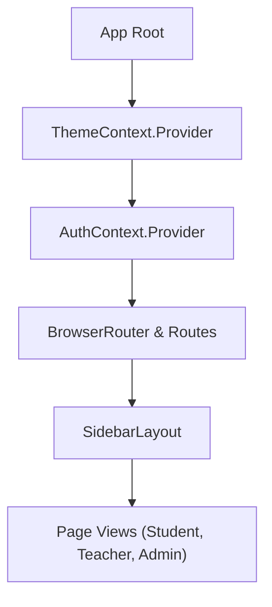

# Frontend Architecture & Design System Guide

This document details the frontend engineering architecture, state management, design tokens, UI component library, and responsive design systems in **E-Study Corner**.

---

## 1. Technology Stack

- **Core Library**: **React 19** (`react`, `react-dom`)
- **Build Tool**: **Vite 6** with lightning-fast HMR and optimized asset bundling
- **Routing**: **React Router v7** (`react-router-dom`)
- **Styling**: **Tailwind CSS v4** (`@tailwindcss/vite`) + Modern CSS Custom Properties
- **Icons**: **Lucide React** (`lucide-react`)
- **HTTP Client**: **Axios** with centralized request/response interceptors

---

## 2. Directory Structure

```
Frontend/src/
├── assets/             # Static logos, banners, and default avatars
├── components/         # Reusable presentation and layout components
│   ├── common/         # StatCard, Modal, SkeletonLoader, ProtectedRoute, RoleRoute
│   ├── dashboard/      # Role-specific dashboard widgets and summary cards
│   ├── notes/          # NoteCard, NoteUploadModal, NoteFilter
│   ├── quiz/           # QuizCard, Timer, QuestionNavigator, ScoreSummary
│   ├── Navbar.jsx      # Global navigation header with quick links & user profile
│   ├── Sidebar.jsx     # Responsive, role-aware sidebar navigation
│   ├── SidebarLayout.jsx # Master layout wrapper combining Navbar + Sidebar
│   └── Footer.jsx      # Platform footer with institutional links & copyright
├── context/            # React Context providers for global state
│   ├── AuthContext.jsx # Authentication, user state, and login/logout handlers
│   └── ThemeContext.jsx# Dark/light mode theme management
├── pages/              # Screen components grouped by role and area
│   ├── Admin/          # User management, audit logs, analytics, feedback
│   ├── Student/        # Courses, assignments, attendance, leaves, bookmarks, quiz
│   ├── Teacher/        # Course authoring, assignment grading, attendance logging
│   └── General/        # Home, About, Contact, Login, Register, Settings
├── services/           # API integration clients
│   └── api.js          # Central Axios client with auto-Bearer injection
├── utils/              # Helper utilities (date formatters, validators, calculations)
├── App.jsx             # Master application router and theme provider
├── main.jsx            # React root mount point
└── index.css           # Global Tailwind CSS imports, tokens, and utility classes
```

---

## 3. Design System & Aesthetics

E-Study Corner features an ultra-modern, glassmorphic aesthetic inspired by contemporary design systems:

### 3.1 Color Palette
- **Primary / Brand**: Indigo to Violet gradients (`from-indigo-600 to-purple-600`)
- **Accent / Energy**: Emerald green (`#10B981`) for success/attendance, Amber (`#F59E0B`) for warnings/deadlines, Rose (`#F43F5E`) for alerts/errors.
- **Surface**:
  - **Light Mode**: Pure white `#ffffff` and subtle slate background `#f8fafc`.
  - **Dark Mode**: Deep midnight obsidian `#0b0f19` and rich slate `#1e293b`.

### 3.2 Glassmorphism & Custom Classes (`index.css`)
```css
/* Glassmorphic card surface */
.glass-panel {
  background: rgba(255, 255, 255, 0.7);
  backdrop-filter: blur(12px);
  -webkit-backdrop-filter: blur(12px);
  border: 1px solid rgba(255, 255, 255, 0.3);
}

.dark .glass-panel {
  background: rgba(15, 23, 42, 0.75);
  border: 1px solid rgba(255, 255, 255, 0.08);
}
```

---

## 4. State Management Architecture

Global application state is managed cleanly using React Context:



### `AuthContext`
- Stores `user`, `token`, and `isAuthenticated` flag.
- Provides `login(credentials)`, `register(userData)`, and `logout()` methods.
- Syncs state changes with `localStorage`.

### `ThemeContext`
- Stores current theme (`light` or `dark`).
- Toggles `.dark` class on the `<html>` root element.
- Persists user preferences in `localStorage.getItem('theme')`.

---

## 5. Layout & Navigation Hierarchy

### `SidebarLayout`
All authenticated views render inside `SidebarLayout.jsx`, which combines:
1. **Top Navbar**:
   - Institutional branding & logo.
   - Global search input.
   - Notification popover with unread counter badge.
   - User profile dropdown and theme toggle.
2. **Role-Aware Sidebar**:
   - Dynamically filters menu items based on `user.role` (Student, Teacher, Admin).
   - Supports smooth collapse/expand for maximum screen real estate.
   - Highlights active navigation items using `NavLink` active states.
3. **Main Content Canvas**:
   - Full responsive padding (`p-4 md:p-6 lg:p-8`).
   - Auto-scroll restoration on page transition.

---

## 6. Responsive Design & Mobile Strategy

- **Breakpoints**: Standard Tailwind breakpoints (`sm: 640px`, `md: 768px`, `lg: 1024px`, `xl: 1280px`).
- **Sidebar Drawer**: On screens `< 768px`, the sidebar slides off-screen into an interactive mobile drawer with an overlay backdrop.
- **Data Tables**: Long tables (e.g., student rosters, attendance sheets) feature horizontal scroll wrappers (`overflow-x-auto`) and card-based fallback layouts for small screens.
