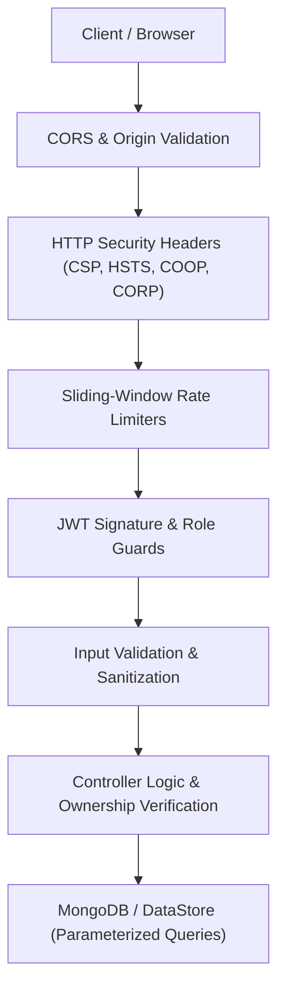

# Security Architecture & Hardening Guide

This document provides a comprehensive breakdown of the security measures, defense-in-depth architecture, HTTP security headers, input sanitization, and vulnerability mitigations implemented in **E-Study Corner**.

---

## 1. Security Architecture Overview

E-Study Corner follows the **Principle of Least Privilege (PoLP)** and multi-tier defense-in-depth:



---

## 2. HTTP Security Headers

All responses pass through `Backend/src/middleware/security.js`, which injects industry-standard OWASP-recommended security headers:

| Header | Configured Value | Security Purpose |
|---|---|---|
| **`Content-Security-Policy`** | `default-src 'self'; script-src 'self' 'unsafe-inline'; style-src 'self' 'unsafe-inline' https://fonts.googleapis.com; font-src 'self' https://fonts.gstatic.com data:; img-src 'self' data: https:; connect-src 'self' http://localhost:* ws://localhost:*; frame-ancestors 'none'; object-src 'none'; base-uri 'self'` | Prevents Cross-Site Scripting (XSS) and data exfiltration. |
| **`Strict-Transport-Security`** | `max-age=31536000; includeSubDomains` | Enforces HTTPS communication for one year. |
| **`X-Frame-Options`** | `DENY` | Prevents Clickjacking attacks by forbidding iframe embedding. |
| **`X-Content-Type-Options`** | `nosniff` | Prevents MIME-type sniffing vulnerabilities. |
| **`Referrer-Policy`** | `strict-origin-when-cross-origin` | Protects privacy by omitting sensitive referral paths. |
| **`Permissions-Policy`** | `camera=(), microphone=(), geolocation=()` | Disables browser hardware access for the web origin. |
| **`Cross-Origin-Opener-Policy`** | `same-origin` | Isolates the browsing context to prevent Spectre-like side-channel leaks. |
| **`Cross-Origin-Resource-Policy`** | `same-origin` | Blocks unauthorized cross-origin resource reads. |
| **`Cache-Control`** | `no-store, no-cache, must-revalidate, proxy-revalidate` (on API routes) | Prevents caching of sensitive student data in browser history or intermediate proxies. |

---

## 3. Rate Limiting & Denial of Service (DoS) Defenses

The backend utilizes sliding-window rate limiters to protect critical services from brute force, enumeration, and denial of service:

```javascript
// Middleware configuration in Backend/src/middleware/security.js
export const apiLimiter = rateLimit({
  windowMs: 15 * 60 * 1000, // 15 minutes
  max: 300,                  // 300 requests per window
  standardHeaders: true,
  legacyHeaders: false,
  message: { success: false, message: 'Too many requests, please try again later.' }
});

export const authLimiter = rateLimit({
  windowMs: 15 * 60 * 1000, // 15 minutes
  max: 5,                   // 5 failed login attempts
  message: { success: false, message: 'Too many login attempts. Please try again after 15 minutes.' }
});
```

---

## 4. Input Sanitization & XSS Mitigation

1. **JSON Body Parsing**: Limited to `10mb` payload size to prevent memory-exhaustion DoS attacks.
2. **Special Character Escaping**: User inputs are sanitized to neutralize `<script>`, `onerror`, and HTML injections.
3. **NoSQL Injection Defense**: All MongoDB queries use Mongoose schema validation and type checking, disallowing arbitrary `$gt` / `$ne` operator injection objects from raw client request bodies.

---

## 5. Path Traversal & Safe File Uploads

When serving files or saving uploads:
- **Filename Sanitization**: User-supplied filenames are stripped of path sequences (`../`, `..\\`) and sanitized with UUID prefixes.
- **Directory Jailing**: File access is strictly bound to designated subdirectories (e.g., `uploads/` or static public assets).
- **MIME Verification**: File uploads validate explicit extensions (`.pdf`, `.png`, `.jpg`, `.docx`) and verify MIME types.

---

## 6. Access Control & IDOR Prevention

- **Token Protection**: JWTs are signed with a minimum 256-bit secret key (`JWT_SECRET`). Tokens expire automatically after 7 days.
- **Ownership Checks**: Mutative operations (e.g., updating a course, editing a quiz, grading an assignment) explicitly verify that the requesting user's `id` matches the resource's owner or that the user has `admin` / `superadmin` privileges.

---

## 7. Vulnerability Disclosure & Audit Checklist

- [x] Passwords hashed with bcrypt (10 rounds).
- [x] Passwords excluded from default user queries (`select: false` or omitted).
- [x] Role escalations prevented via explicit server-side role validation.
- [x] CORS restricted to authorized frontend origins.
- [x] CSP and anti-clickjacking headers active on all API responses.
- [x] Production database disconnect triggers 503 fallback rather than silent unauthenticated states.
